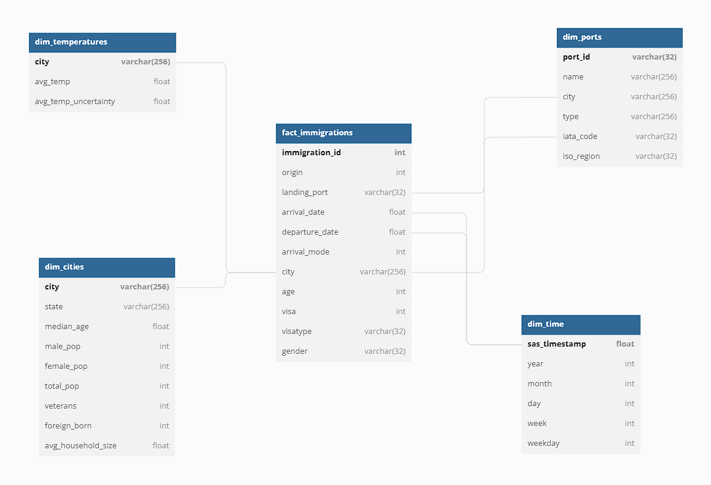
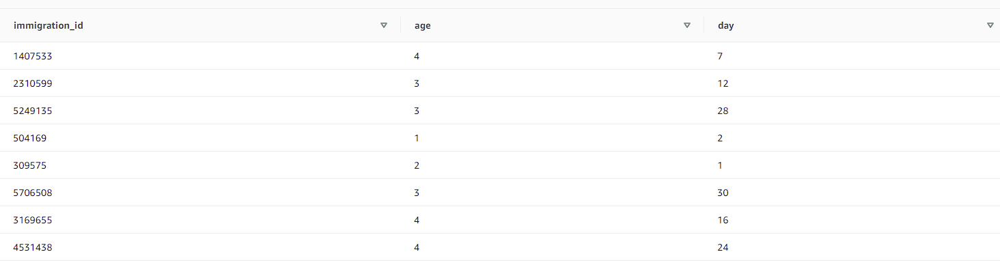
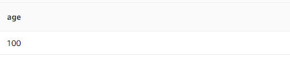
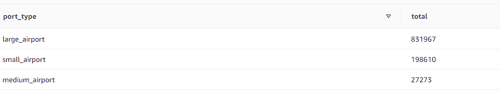
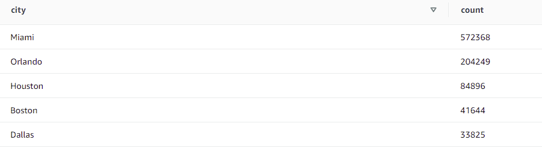
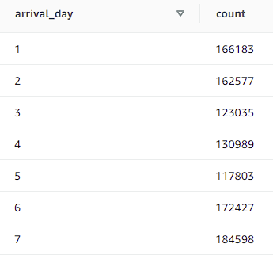

# I94 Single Source of Truth Data Warehouse

## Project Purpose and Scope

**Udacity Data Engineering Nanodegree Program Capstone Project**

Purpose of this project is to create a single source of truth data warehouse to analyze I94 immigration records. We have been provided a variety of datasets including I94 immigration data logs, U.S. cities demographics, travel ports, and approximate temperatures across cities.

## Technologies and Tools

- Apache Spark           : Apache spark is chosen since it is the state-of-art computing engine.
- Amazon Redshift and S3 : Due to working together too well and easy usage, S3 is chosen as a data lake technology while Redshift is as a warehouse.

## Data Model

## Files
    1. Capstone Project Template.ipynb : This file is used to explore, experiment and clean data as well as create the pipeline.
    2. I94_SAS_Labels_Descriptions.SAS : Contains column descriptions of immigration files.
    3. SAS Data files                  : Provided within Udacity workspace. Month by month I94 immigration log files.
    4. dl.cfg                          : Contains access, secret access keys and redshift database configuration information.
    5. etl.py                          : This file contains the source code of the whole etl process.
    6. us-cities-demographics.csv      : Contains information regarding US cities demographics
    7. airport-codes_csv.csv           : Provided within Udacity workspace. Contains information regarding airports, heliports and seaplane bases throughout the world.
    8. GlobalLandTemperaturesByCity.csv: Provided within Udacity workspace. Contains timestamped temperature information of cities across the world.
    9. create_tables.sql               : Contains Amazon Redshift table creation queries.

## Data Cleaning and Considerations

* All the null values have been cleared of datasets.
* Columns with large amounts of missing values have been removed.
* Some of the columns that are by no means helpful for the scope of the project are also removed.
* All duplicates are removed from the final data frames.
* Only US-related data in the temperatures data are used within the project. The temperature data remaining are averaged and grouped by city.
* 'municipality' column of port data is treated as city to join port and city data.
* Ports data is cleaned from non-US records, null iata_code records and 'closed' port type records.

## Data Dictionary

| Table      | Field | Type | Description |
| -----------| ----- | ---- | ----------- |
| fact_immigrations | immigrations_id | INT4 | ID of the immigrant (PK) |
| fact_immigrations | origin  | INT4 | Origin country code of the immigrant |
| fact_immigrations | landing_port  | VARCHAR | IATA code of the landing port of the immigrant |
| fact_immigrations | arrival_date  | FLOAT8 | Arrival date of the immigrant in SAS format |
| fact_immigrations | departure_date  | FLOAT8 | Departure date of the immigrant in SAS format |
| fact_immigrations | arrival_mode  | INT4 | 1 ='Air', 2 = 'Sea', 3 = 'Land', 9 = 'Not reported'|
| fact_immigrations | city  | VARCHAR | City where the immigrant will stay |
| fact_immigrations | age   | INT4 | Age of the immigrant |
| fact_immigrations | visa  | INT4 | Visa code: 1 = Business, 2 = Pleasure, 3 = Student |
| fact_immigrations | visatype | VARCHAR | Class of admission legally admitting the non-immigrant to temporarily stay in U.S. |
| fact_immigrations | gender  | VARCHAR | Gender of the immigrant |
|-|-|-|-|
| dim_cities  | city | VARCHAR | Name of the city (PK) |
| dim_cities  | state | VARCHAR | Name of the state |
| dim_cities  | median_age | FLOAT8 | Median age of the city |
| dim_cities  | male_pop  | INT4 | Male population |
| dim_cities  | female_pop  | INT4 | Femala population |
| dim_cities  | total_pop  | INT4 | Total population |
| dim_cities  | veterans  | INT4 | Number of veterans |
| dim_cities  | foreign_born  | INT4 | Number of foreign-borns |
| dim_cities  | avg_household_size  | FLOAT8 | City name |
|-|-|-|-|
| dim_ports  | port_id  | VARCHAR | Unique port identifier (PK) |
| dim_ports  | name   | VARCHAR | Name of the port |
| dim_ports  | city   | VARCHAR | City where port is in |
| dim_ports  | type   | VARCHAR | Airport, heliport or seaplane base |
| dim_ports  | iata_code   | VARCHAR | IATA code of the port |
| dim_ports  | iso_region   | VARCHAR | State code where the port is in |
|-|-|-|-|
| dim_temperatures  | city | VARCHAR | City name (PK) |
| dim_temperatures  | avg_temp | FLOAT8 | Average temperature |
| dim_temperatures  | avg_temp_uncertainty | FLOAT8 | Average temperature uncertainty |
|-|-|-|-|
| dim_time  | sas_timestamp | FLOAT8 | Timestamp in SAS format (PK) |
| dim_time  | year | INT4 | year |
| dim_time  | month | INT4 | month |
| dim_time  | day | INT4 | day |
| dim_time  | week  | INT4 | week number of the sas_timestamp |
| dim_time  | weekday | INT4 | 1=Sunday, 2=Monday, 3=Tuesday, 4=Wednesday, 5=Thursday, 6=Friday, 7=Saturday |

## What If...

* The data was increased by 100x ?
  
    Even in current situation, whole ETL process takes too long and its usage on a narrow schedule may not be meaningful. Thats why only the first 3 months of dataset is used. If the data is to be increased by 100x and the remaining months of data are to be added, it is highly recommended to use an EMR cluster with multiple nodes (or similar tech) to improve performance.

* The pipelines would be run on a daily basis by 7 am every day ?
    
    Apache Airflow would be an excellent choice to run the ETL on a daily basis. DAG should be configured as follow:
    
    <pre><code>schedule_interval='0 7 * * *'</code></pre>

* The database needed to be accessed by 100+ people ?

    Amazon Redshift can handle 100+ users easily.

## Execution 

To execute the project, the following steps must be done **in order**:

1) Create a redshift cluster in **us-west-2** region and enable public accessibility.
2) Execute the table creation commands in create_tables.sql file.
3) Fill the dl.cfg file according to cluster settings.
4) Create an S3 bucket in **us-west-2** region and set the 'output_data' variable in etl.py to the bucket name.
5) Get your coffee and run etl.py on terminal.

## Some example queries

Once the etl process is completed, **Redshift query editor** can be used to analyze data. Below are some example queries:

1) Get ID, age and arrival day of the month of the immigrants who used Orlando Executive Airport and younger than 5 years old 

<pre><code>select immigration_id,immig.age,dimt.day
from fact_immigrations immig join dim_time dimt on immig.arrival_date = dimt.sas_timestamp
where immig.age < 5 and immig.landing_port = 'ORL'</code></pre>

2) How old is the oldest immigrant?

<pre><code>SELECT age FROM fact_immigrations ORDER BY age DESC LIMIT 1</code></pre>

3) Get port types used by immigrants in order
   
<pre><code>SELECT ports.type as port_type, COUNT(*) as total
FROM fact_immigrations immig JOIN dim_ports ports ON immig.city = ports.city AND immig.landing_port = ports.iata_code
GROUP BY  ports.type
ORDER BY total DESC</code></pre>

4) Top 5 popular cities amongst immigrants

<pre><code>SELECT city, count(*)
FROM fact_immigrations
GROUP BY city
ORDER BY count DESC
LIMIT 5</code></pre>

5) What day of the week do the immigrants prefer coming to the US? (1=Sunday, ... ,7=Saturday)

<pre><code>SELECT dimt.weekday as arrival_day, count(*)
FROM fact_immigrations immig JOIN dim_time dimt ON immig.arrival_date = dimt.sas_timestamp
GROUP BY dimt.weekday
ORDER BY arrival_day ASC</code></pre>

## Author

[Arda Aras](https://www.linkedin.com/in/arda-aras/)

